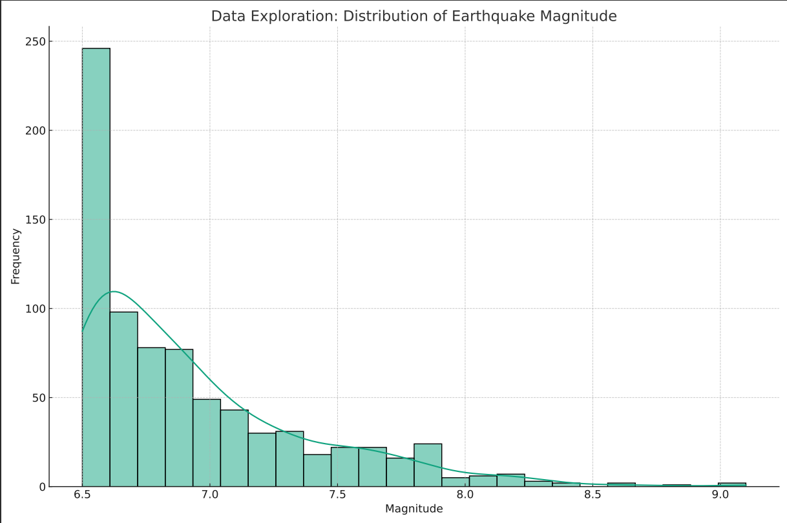
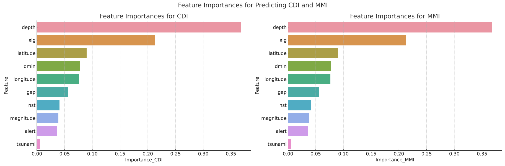

# Earthquake-Intensity-and-Impact-Prediction

## **Introduction**
This project aims to develop an AI-driven system for predicting earthquake intensity and impact. The objective is to contribute to early warning capabilities for earthquake mitigation.

## **Data Exploration**
The dataset contains various features like magnitude, latitude, longitude, depth, and other seismic activity measures. The distribution of earthquake magnitudes shows that most earthquakes are in the range of 6.5 to 7.5, which is considered strong but not extremely catastrophic.

## **Data Preprocessing**
Missing values were handled based on the data type.
For numerical columns, the median value was used to fill the gaps.
For categorical columns, an 'Unknown' category was used to fill missing values.

## **Feature Engineering**
The following features were selected for prediction based on their relevance:
Magnitude
CDI (Community Internet Intensity Map)
MMI (Modified Mercalli Intensity)
Tsunami
Significance (Sig)
Number of Stations (Nst)
Minimum Distance (Dmin)
Azimuthal Gap (Gap)
Depth
Latitude and Longitude

## **Model Training and Evaluation**
Three machine learning models were trained: Linear Regression, Random Forest, and Support Vector Regressor. Mean Squared Error (MSE) was used as the metric for evaluation.
**Results:**
For CDI prediction, Random Forest had the lowest MSE of 3.21.
For MMI prediction, Random Forest had the lowest MSE of 0.83.

## **Feature Importance Analysis**
Feature importance was analyzed for the best-performing model (Random Forest). The most influential features for predicting both CDI and MMI were Depth and Significance (Sig).

## **Conclusion**
The Random Forest model showed the best performance for predicting both CDI and MMI. Feature importance analysis revealed 'Depth' and 'Significance' as the most influential variables. The model serves as a step towards developing an early warning system for earthquakes.
